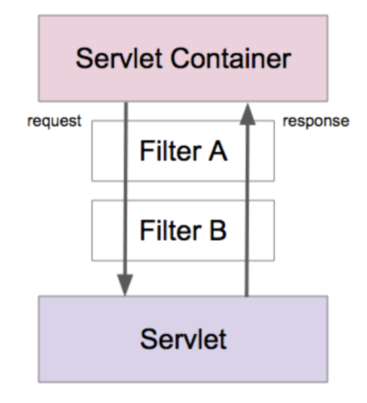
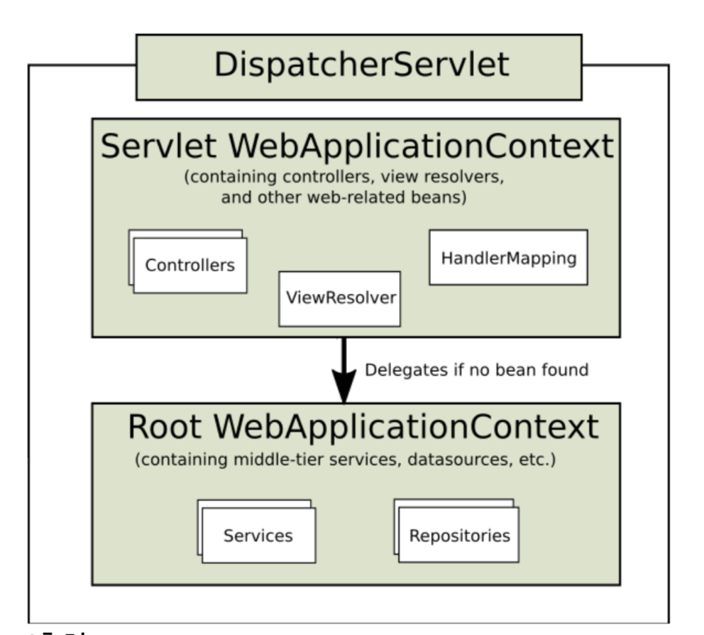
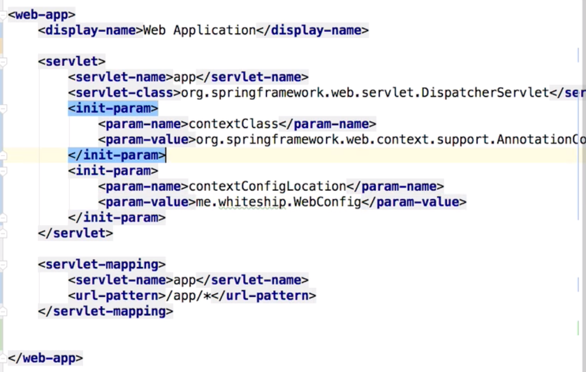
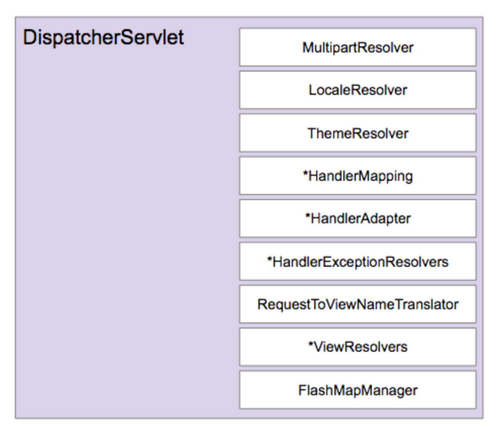
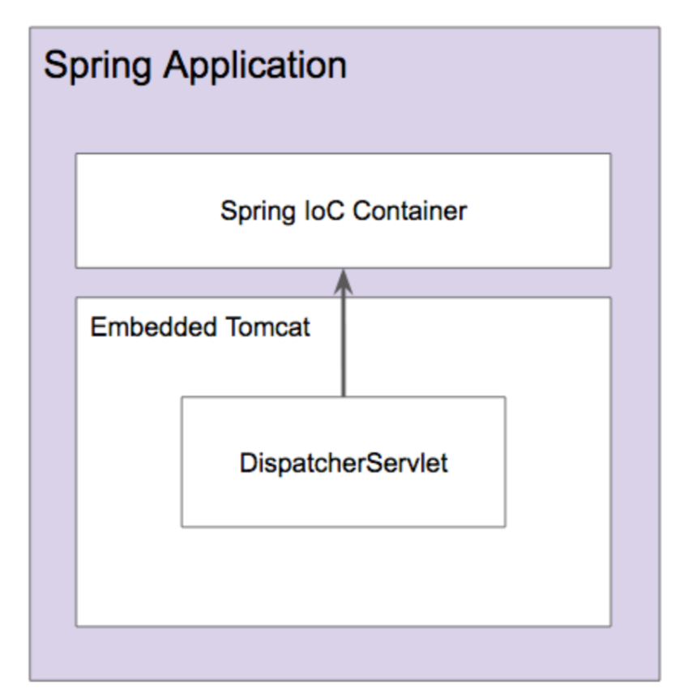
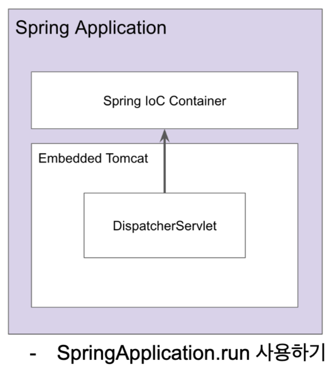
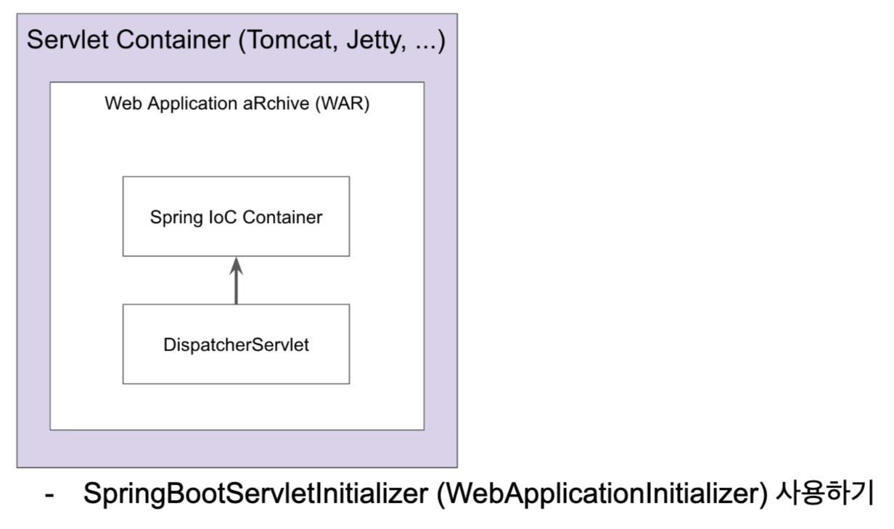

# Spring MVC


1. 프로젝트 만들기
   - File -> New -> Project -> Spring Initializr
   - project 이름 설정
   - Java version 선택
   - Maven/Gradle 설정
   - 의존성 추가(Web==Spring Boot Starter, Lombok, Thymleaf)


## 1부. Spring MVC 동작 원리

1. MVC란?

   - M: Model

     - 평범한 자바 객체 POJO
     - 도메인 객체
     - DTO로 화면에 전달할 객체
     - 화면에서 전달 받은 데이터를 담고 있는 객체

   - V: View

     - HTML, JSP, Thymleaf 등
     - 데이터를 보여주는 역할
     - HTML, JSON, XML 등 다양한 형태로 보여줄 수 있다.

   - C: Controller

     - Spring @MVC

     - 사용자 입력을 받아 모델 객체의 데이터를 변경

     - 사용자 입력을 받아 모델 객체를 뷰에 전달하는 역할

       - 입력값 검증

       - 입력 받은 데이터로 모델 객체 변경

       - 변경된 모델 객체를 뷰에 전달

2. MVC 장점

   - 동시 다발적(Simultaneous) 개발: 백엔드 개발자와 프론테엔드 개발자가 독립적으로 개발을 진행할 수 있다.
   - 높은 결합도: 논리적으로 관련있는 기능을 하나의 컨트롤러로 묶거나, 특정 모델과 관련있는 뷰를 그룹화 할 수 있다.
   - 낮은 의존성: 뷰, 모델, 컨트롤러는 각각 독립적이다.
   - 개발 용이성: 책임이 구분되어 있어 코드 수정하는 것이 편한다.
   - 한 모델에 대한 여려 형태의 뷰를 가질 수 있다.

3. MVC 단점
   - 코드 네비게이션 복잡함
   - 코드 일관성 유지에 노력이 필요함
   - 높은 학습 곡선

4. 서블릿(Servlet)
   - 자바 엔터프라이즈 에디션은 웹 애플리케이션 개발용 스펙과 API 제공
   - 요청 당 Thread 사용( 새로 만들거나, Pool에서 가져옴)
   - 그 중에 가장 중요한 클래스중 하나가 HttpServlet.
   - CGI(Common Gatewat Interface): Servlet 이전에 사용하던 기술
5. 서블릿 장점
   - 빠르다.
   - 플랫폼에 독립적이다.
   - 보안이 제공된다.
   - 이식성이 있다.
6. 서블릿 엔진/컨테이너 종류
   - 톰캣
   - 제티
   - 언더토 
7. 서블릿 엔진/컨테이너 역할
   - 세션 관리
   - 네트워크 서비스
   - MIME 기반 메시지 인코딩 디코팅
   - 서블릿 생명주기 관리
8. 서블릿 생명주기
   - Servlet Container가 Servlet instance init() 메소드를 호출하여 초기화 한다.
     - 최초 요청을 받았을 때, 한번 초기화 하고 나면 그 다음 요청부터는 이 과정이 생략된다.
   - Servlet이 초기화 된 다음부터 클라이언트의 요청을 처리할 수 있다.
     - 각 요청은 별도의 쓰레드로 처리하고 이때, Servlet instance service() 메소드를 호출한다.
     - service() 메소드 안에서, http 요청/응답을 처리한다.
     - service() 메소드는 보통 HTTP Method에 따라 doGet(), doPost() 등으로 처리를 위임한다.
     - 즉, 보통 doGet(), doPost() 메소드에서 요청에 대한 처리를 로직을 구현한다.
   - Servlet Container의 판단에 따라, Servlet instance를 메모리에서 내려야 할 시점에 destroy()를 호출한다.
9. 서블릿 생명주기 요약
   - init
   - doGet
   - doPost
   - destroy

10. 서블릿 리스너와 필터

    - 서블릿 리스터: 웹 애플리케이션에서 발생하는 주요 이벤트를 감지하고, 각 이벤트에 특별한 작업이 필요한 경우에 사용할 수 있다.

      - Servlet Context level event(db 연결/해제시 사용 할 수 있다.)
        - Context LifeCycle event
        - Context Attribute Change event
      - Session level event
        - Session LifeCycle event
        - Session Attribute Change event

    - 서블릿 필터: 클라이언트 요청을 서블릿으로 보내기전에, 서블릿의 응답을 클라이언트로 보내기 전에, 특별한 처리가 필요한 경우에 사용할 수 있다.

      - 체인 형태 구조(A,B 순서대로 적용)

      - doFilter() 메소드를 통해 사용

        


### 7) Spring IoC Container 연동

**Servlet에서 Spring이 제공하는 IoC 컨테이너 활용하는 방법**

1. ContextLoaderListner
   - Servlet Listner 구현체
   - ApplicationContext를 만들어 준다.
   - ApplicationContext를 Servlet Context LifeCycle에 따라 등록하고 소멸시켜준다.
   - Servlet에서 IoC Container를 ServletContext를 통해 꺼내 사용할 수 있다.
2. 사용법
   - pom.xml에 spring-webmvc dependency 추가
   - web.xml 파일에 <listener>태그를 추가한다.
   - <listener>태그 내부에 <listener-class>org.springframework.web.context.ContextLoaderListener를 추가한다.
3. 동작 과정
   - Spring IoC Container(즉, ApplicationContext)를 Servlet Context에 등록해주게 됨.
   - 그러면, Servlet 생명주기에 맞춰서 spring ApplicationContext가 바인딩 되어 동작하게 됨.
   - Servlet이 종료되는 시점에 spring ApplicationContext를 제거해줌.




### 8) Spring MVC 연동

**Spring이 제공하는 Servlet 구현체 DispatcherServlet 사용하기**

1. DispatcherServlet

   - Spring MVC의 핵심
   - Front Controller 역할 수행
     - 모든 요청을 받아 적절하게 다른 Controller에게 dispatch(= delegate, =위임)

   - 등록 방법
     - web.xml 파일에 여러개의 servlet과 servlet-mapping을 등록하여 servlet application을 구축할 수 있다는 것을 기억하자.
     - web.xml 파일에 <servlet>태그를 이용해 Dispatcher Servlet 등록
     - <init-param>태그를 통해 contextClass와 contextConfigLoacation을 등록
     - WebConfig.java 파일에서 @ComponentScan 어노테인션을 사용해 Bean 등록
     - 우리는 Spring MVC를 구현하기 위해서, Spring이 제공하는 DispatcherServlet을 web.xml파일에 등록하고, 적절한 경로를 servlet-mapping을 통해 등록할 수 있다.

   

**주의**

- Spring Boot 프로젝트는 Spring이라는 Java Application 안에, Tomcat이 뜨고, 그 안에 Servlet Container에 DispatcherServlet이 코드로 들어가 있는 형태
  - 즉, Spring이 밖에 나와 있는 형태
- Spring MVC 프로젝트는 tomcat이 먼저 뜨고, 그 안에 Servelt Container에 DispatcherServlet을 등록하는 형태
  - 즉, Spring이 안에 들어가 있는 형태


### 9) DispatcherServlet 동작 원리 1부

1. DispatcherServlet 초기화
   - 아래의 특별한 타입의 Bean들을 찾거나, 기본 전략에 해당하는 Bean들을 등록한다.
   - HandlerMapping: 핸들러를 찾아주는 인터페이스(디자인 패턴: Strategy pattern 사용)
   - HanlderAdapter: 핸들러를 실행하는 인터페이스(디자인 패턴: Strategy pattern 사용)
   - HandlerExceptionResolver
   - ViewResolver
   - ...
2. DispatcherServlet 동작 순서
   - 요청을 분석한다.(Locale, Theme, MultiPart 등)
   - (핸들러 맵핑을 위임하여)요청을 처리할 핸들러를 찾는다.
   - (등록되어 있는 핸들러 어댑터 중에) 해당 핸들러를 실행할 수 있는 "핸들러 어댑터"를 찾는다.
   - 찾아낸 "핸들러 어댑터"를 사용해서 핸들러의 응답을 처리한다.
     - 핸들러의 리턴값을 보고 어떻게 처리할지 판단한다.
     - View 이름에 해당하는 View를 찾아서 Model 데이터를 렌더링한다.
     - @ResponseEntity가 있다면 Convert를 사용해서 응답 본문을 만든다.
   - (부가적으로) 예외가 발생했다면, 예외 처리 핸들러에 요청 처리를 위임한다.
   - 최종적으로 응답을 보낸다.
3. HandlerMapping
   - RequestMappingHandlerMapping
4. HandlerAdapter
   - RequestMappingHandlerAdapter

**추가**

- @RestController = @Controller + @ResponseBody
- @ResponseBody가 없으면 문자열을 ModelAndView로 인식한다. -> model -> view -> 응답
- @ResponseBody가 있으면 문자열을 ModelAndView로 인식하지 않는다! -> 문자열 응답


### 10) DispatcherServlet 동작 원리 2부: SimpleController

- Dispatcher Servlet에는 기본적으로 아래 2개의 핸들러 맵핑이 등록되어 있기 때문에, 우리가 어노테이션으로 요청을 맵핑할 수 있는 것

1. HanlderMapping
   - BeanNameUrlHandlerMapping
   - RequestMappingHandlerMapping
2. HandlerAdapter
   - SimpleControllerHandlerAdapter

```java
//이렇게 우리가 직접 구현할 수도 있다.
@org.springframework.stereotype.Controller("/simple")
public class SimpleController implements Controller{
  @Override
  public ModelAndView handleRequest(HttpServletRequest request, HttpServletResponse response) throw Exception{
    return new ModelAndView("/WEB-INF/simple.jsp")
  }
}
```


### 11) DispatcherServlet 동작 원리 3부: 커스텀 ViewResolver

1. ViewResolver
   - InternalResourceViewResolver
2. InternalResourceViewResolver
   - Prefix
   - Suffix

```java
@Configuration
@ComponentScan
public class WebConfig{
  @Bean
  public InternalResourceViewResolver viewResolver(){
    InternalResourceViewResolver viewResolver = new InternalResourceViewResolver();
    viewResolver.setPrefix("/WEB-INF");
    viewResolver.setSuffix(".jsp");
    return viewResolver;
  }
}
```

```java
@org.springframework.stereotype.Controller("/simple")
public class SimpleController implements Controller{
  @Override
  public ModelAndView handleRequest(HttpServletRequest request, HttpServletResponse response) throw Exception{
    return new ModelAndView("simple") // Prefix, Suffix 덕분에 이렇게 사용가능
  }
}
  
```


### 12) Spring MVC 기본 구성 요소



1. DispatcherServlet의 기본 전략
   - DispatcherServlet.properties
2. MultipartResolver
   - 파일 업로드 요청 처리에 필요한 인터페이스
   - HttpServletRequest를 MultipartHttpServletReuqest로 변환해주어 요청이 담고 있는 File을 꺼낼 수 있는 API 제공
   - Spring Boot는 MultipartResolver 구현체를 기본 Bean으로 등록해서 제공함.
3. LocalResolver
   - 클라이언트 위치(Locale) 정보를 파악하는 인터페이스
   - 기본 전략은 요청의 accept-language를 보고 판단.
4. ThemeResolver
   - 애플리케이션에 설정된 테마를 파악하고 변경할 수 있는 인터페이스
   - 예륻들어, dark mode 변환 같은 것
5. HandlerMapping(여래개 빈 사용)
   - 요청을 처리할 핸들러를 찾는 인터페이스
   - RequestMappingHanlderMappling: 우리가 어노테이션을 이용해 설정한 핸들러를 기준으로 찾아줌
   - BeanNameUrlHandlerMapping: Bean이름을 기반으로 핸들러를 찾아줌
6. HandlerAdapter(여러개 빈 사용)
   - HandlerMapping이 찾아낸 "핸들러"를 처리하는 인터페이스
   - Spring MVC 확장력의 핵심
7. HandlerExceptionResolver(여러개 빈 사용)
   - 요청 처리 중에 발생한 에러를 처리하는 인터페이스
   - @ExceptionHandler로 정의한 메서드를 찾아서 사용
8. RequestToViewNameTranslator
   - 핸들러에는 View 이름을 명시적으로 리턴하지 않은 경우, 요청을 기반으로 뷰 이름을 판단하는 인터페이스
9. ViewResolver
   - View 이름(String)에 해당하는 View를 찾아내는 인터페이스
10. FlashMapManager
    - FlashMap 인스턴스를 가져오고 저장하는 인터페이스
    - Post요청에서 form 중복 요청을 거를 수 있다.
    - FlashMap은 주로 리다이렉션을 사용할 때 요청 매개변수를 사용하지 않고, Url을 더럽히지 않고, 깔끔하게 데이터를 전달하고 정리할 때 사용한다.
    - redirect:/events


### 13. Spring MVC 동작 원리 정리

1. 결국엔 Spring MVC는 굉장히 복잡한 Servlet = DispatcherServlet 이라고 생각하면 된다.

2. DispatcherServlet 초기화

   - 특정 타입에 해당하는 빈을 찾는다.
   - 없으면 기본 전략을 사용한다.(DispatcherServlet.properties)

3. Spring Boot를 사용하지 않는 Spring MVC

   - Servlet Container(ex. tomcat)에 등록한 웹 어플리케이션(WAR)에 DispatcherServlet을 등록한다.

     - 방법1) web.xml에 서블릿 등록

     - 방법2) WebApplicationInitializer에 자바 코드로 서블릿 등록(Spring 3.1+, Servlet 3.0 +)

       

   - 세부 구성 요소는 Bean 설정하기 나름

4. Spring Boot를 사용하는 Spring MVC

   - 자바 어플리케이션에 내장 톰캣을 만들어 그 안에 DispatcherServlet을 등록한다.
     - Spring Boot이 자동으로 설정해줌
   - Spring Boot 주관에 따라 여러 인터페이스 구현체를 빈으로 등록한다.


## 2부. Spring MVC 설정


### 1. @Configuration을 사용한 자바 설정 파일에 직접 @Bean을 사용해서 Spring MVC 구성 요소 등록하기(구식)

```java
//아래와 같이 설정해주면, 기본 Spring MVC 구성 요소 대신, 우리가 정의한 빈으로 사용해줌

@Configuration
@ComponentScan
public class WebConfig{
  @Bean
  public HandlerMapping handlerMapping(){
    RequestMappingHandlerMapping handlerMapping = new RequestMappingHandlerMapping();
    handlerMapping.setInterceptors();
    handlerMapping.setOrder(Ordered.HIGHEST_PRECEDENCE);
    return handlerMapping;
  }
  
  @Bean
  public HandlerAdapter handlerAdapter(){
    //request handler에서 @PathVariable int id, @RequestParam String name 등을 arguments로 받는 것을 처리하기 위해서
    RequestMappingHandlerAdapter handlerAdapter = new RequestMappingHandlerAdapter();
    handlerAdapter.
    return handlerAdapter;
  }
  
  @Bean
  public ViewResolver viewResolver(){
    InternalResourceViewResolver viewResolver = new InternalResourceViewResolver();
    viewResolver.setPrefix("/WEB-INF/");
    viewResolver.setSuffix(".jsp");
    return viewResolver;
  }
}
```


### 2. @EnableWebMvc 어노테이션을 사용하여 Spring MVC를 사용할 때 편리한 웹 MVC 기본 설정 방법 사용하기

- @EnableWebMvc: 기존 설정 빈 + 유요한 서정 빈들을 Import해서 제공함
- 단, @EnableWebMvc 어노테이션을 사용하는 경우, servletContext를 셋팅해줘야함(내부적으로 종종 사용하기 때문에)
- @EnableWebMvc는 Delegation하는 구조로 되어 있음.(확장성을 위해)

```java
public class WebApplication implements WebApplicationInitialier{
  @Overrride
  public void onStartup(ServletContext servletContext) throws ServletException{
    AnnotationConfigWebApplicationContext context = new AnnotationConfigWebApplicationContext();
    context.setServletContext(servletContext);
    context.register(WebConfig.class);
    context.refresh();
    
    DispatcherServlet dispatcherServlet = new DispatcherServlet(context);
		...
  }
}

@Configuration
@EnableWebMvc
public class WebConfig{
  
}
```

### 3. WebMvcConfigure 인터페이스: @EnableWebMvc가 제공하는 빈을 커스터마이징 할 수 있는 기능 제공

```java
@Configuration
@EnableWebMvc
public class WebConfig implements WebMvcConfigurer{
  @Override
  public void configureViewResolvers(ViewResolverRegistry registry){
    registry.jsp("/WEB-INF/","jsp"); // prefix, suffix를 제공하는 기능
  }
}
```

- WebMvcConfigurer 인터페이스가 제공하는 메소드를 커스터마이징 해서, 위 2번 방법보다 간편하게 설정할 수 있음

### 4. Spring Boot의 Spring MVC 설정

1. Spring Boot의 "주관"이 적용된 자동 설정이 동작한다.
   - JSP 보다 Thymeleaf 선호
   - JSON 지원
   - 정적 리소스 지원(+ Welcome 페이지, favicon 등 지원)
2. Spring MVC 커스터마이징
   - application.properties(spring boot에서 사용)
   - @Configuration + Implements WebMvcConfigurer(= Spring Boot의 Spring MVC 자동설정 + 직접 추가 설정)
   - @Configuration + **@EnableWebMvc** + Implements WebMvcConfigurer(= Spring Boot의 **자동설정을 사용하지 않고 직접 추가 설정**)



3. **Spring Boot는 handlerMapping에서 SimpleUrlHandlerMapping을 지원하고, baseName="resourceHandlerMapping"이기 때문에, resources/static 또는 resources/templates 밑에 view 파일을 두고 처리하는 것이 가능하다.**
4. Spring Boot는 View를 찾아오기 위해, ContentNegotiatingViewResolver라는 것을 사용하여, 아래 ViewResolver중에서 적절한 viewResolver를 선택하여 제공
   - BeanNameViewResolver
   - ThymeleafViewResolver(타임리프)
   - ViewResolverComposite
   - InternalResourceViewResolver(기본)

### 5. Spring Boot에서 JSP 사용하기

1. 제약사항
   - JAR 프로젝트로 만들 수 없음, WAR 프로젝트로 만들어야 함
   - Java-JAR로 실행할 수는 있지만, "실행가능한 JAR 파일"은 지원하지 않음
   - 언더토우(JBoss에서 만든 Servlet Conainer)는 JSP를 지원하지 않음
   - Whitelabel 에러 페이지를 error.jsp로 오버라이딩 할 수 없음.
2. 의존성 추가

```xml
<dependency>
  <groupId>javax.servlet</groupId>
  <artifactId>jstl</artifactId>
</dependency>
<dependenct>
	<groupId>org.apache.tomcat.embed</groupId>
  <artifactId>tomcat-embed-jasper</artifactId>
  <scope>provided</scope>
</dependenct>
```

3. 태그 선언

   ```jsp
   <%@ taglib prefix="c" uri="http://java.sun.com/jsp/jstl/core"%>
   ```

4. application.properties

   ```
   spring.mvc.view.prefix=/WEB-INF/jsp
   spring.mvc.view.suffix=.jsp=
   ```

5. spring boot의 ./mvnw package 라는 명령어를 사용하면, maven이 설치가 되어 있지 않아도 빌드가능

### 6. WAR 파일 실행/배포하기

1. java -jar를 사용해서 실행하기

   ```java
   @SpringBootApplication
   public static void main(String[] args){
     SpringApplicatoin.run(DemoJspApplication.class, args);
   }
   ```

   

   

2. Servlet Container에 배포하기

```java
public class ServletInitializer extends SpringBootServeltInitializer{
  @Override
  protected SpringApplicationBuilder configure(SpringApplicationBuilder application){
    return application.sources(DemoJspApplication.class);
  }
}
```




###  7. Formatter 추가하기

```java
@RestController
public class SampleController{
  @GetMapping("/hello/{name}")
  public String hello(@PathVariable("name") Person person){ // argument 부분을 formatting 하기 위해서 아래의 foramtter를 정희해서 추가하는 것임!!
    return "hello"+person.getName();
  }
}
```


1. Formatter
   - Printer: 해당 객체를 (Locale 정보를 참고하여) 문자열로 어떻게 출력할 것인가
   - Parser: 어떤 문자열을 (Locale 정보를 참고하여) 객체로 어떻게 변환할 것인가

```java
public class PersonFormatter implements Formatter<Person>{
  @Override
  public Person parse(String text, Locale locale) throws ParseException{
    Person person = new Person();
    person.setName(text);
    return person;
  }
  
  @Override
  public String print(Person object, Locale locale){
    return object.toString();
  }
}
```

1. 추가 방법1
   - WebMvcConfigurer의 addFormatters(FormatterRegistry) 메소드 정의

```java
@Configuration
public class WebConfig implements WebMvcConfigurer{
  @Override
  public void addFormatters(FormatterRegistry registry){
    registry.addFormatter(new PersonFormatter());
  }
}
```


1. 추가 방법2
   - Spring Boot 사용시에만 가능
   - 해당 Formatter를 Bean으로 등록하여 사용
   - Spring Boot 에서는 아래와 같이 빈으로 등록해주면, WebConfig 파일에서 따로 formatter를 추가할 필요가 없다.

```java
@Component
PersonFrmatter
```


### 8. 도메인 클래스 Convertter 자동 등록

1. Spring Data JPA는 Spring MVC용 도메인 클래스 Converter를 제공합니다.

2. 도메인 클래스 Converter

   - Spring Data JPA가 제공하는 Repository를 사용해서 ID에 해당하는 Entity를 읽어옵니다.

3. 의존성 설정

   ```xml
   <dependency>
   	<groupId>org.springframework.boot</groupId>
     <artifactId>spring-boot-starter-data-jpa</artifactId>
   </dependency>
   
   <dependency>
   	<groupId>com.h2.database</groupId>
     <artifactId>h2</artifactId>
   </dependency>
   ```

4. Entity Mapping

   - @Generatedvalue: 데이터베이스에 들어갈때 자동으로 id값을 생성하고 싶은 경우 사용.

   ```java
   @Entity
   public class Person{
     @Id @Generatedvalue
     private Integer id;
     ...
   }
   ```

5. Repository 추가

   ```java
   public interface PersonRepository extends JpaRepository<Person, Integer>{}
   ```

6. 테스트 코드 수정

   - 테스트용 이벤트 객체 생성
   - 이벤트 Repository에 저장
   - 저장한 이벤트의 ID로 조회 시도

   ```java
   @RunWith(SpringRunner.class)
   @SpringBootTest
   @AutoConfigureMockMvc
   public class SampleControllerTest{
     @Autowired
     MockMvc mockMvc;
     @Autowired
     PersonRepository personRepository;
     @Test
     public void hello() throws Excpetion{
       Person person = new Person();
       Person.setName("keesun");
       Person savedPerson = personRepository.save(person);
       
       this.mockMvc.perform(get("/hello"))
         .param("id", savedPerson.getId().toString())
         .addDo(print()) // log 찍어주는 기능
         .addExpect(content().string("hello keesun")) // 결과값 확인하는 기능
     }
   }
   ```

   

### 9. 핸들러 인터셉터 1부: 개념

1. HandlerInterceptor

   - HandlerMapping에 설정하는 수 있는 인터셉터
   - Handler를 실행하기 전, 후(아직 rendering 전) 그리고 완료(rendering 끝난 이후)시점에 부가 작업을 하고 싶은 경우에 사용할 수 있다.
   - 여러 Handler에서 반복적으로 사용하는 코드를 줄이고 싶을 때 사용할 수 있다.
     - Logging, Auth, Locale 변경 등

2. boolean preHandle(request, response, handler)

   - Handler 실행하기 전에 호출 됨
   - Handler에 대한 정보를 사용할 수 있기 때문에, Servlet Filter에 비해 보다 세밀한 로직 구현 가능
   - return 값으로 계속 다음 인터셉터 또는 Handler로 요청, 응답을 전달할지(true), 응답 처리가 이곳에서 끝났는지(false)를 알린다.

3. void postHandle(request, response, modelAndView)

   - Handler 실행이 끝나고, 아직 View Rendering 하기 이전에 호출됨
   - View에 전달할 추가적이거나 여러 핸들러에 공통적인 Model 정보를 담는데 사용할 수 있다.
   - 이 메소드는 인터셉터 역순으로 호출된다.
   - 비동기적인 요청 처리 시에는 호출되지 않는다.

4. void afterCompletion(request, response, handler, ex)

   - 요청 처리가 완전히 끝난 뒤(View Rendering이 완료된 뒤)에 호출됨
   - preHandler에서 true를 리턴한 경우에만 호출됨
   - 이 메소드는 인터셉터 역순으로 호출됨
   - 비동기적인 요청 처리 시에는 호출되지 않는다.

5. Servlet Filter(doFilter())와 Handler Interceptor 비교

   - Servlet Filter 보다 구체적인 처리가 가능
   - Servelt 보다 일반적인 용도의 기능을 구현하는데 사용하기에 좋다.

   - 참고자료: 스프링 개발자 Mark Fisher의 Servlet Filter와의 차이점에 대한 찾아보면 좋다.
   - Cross-Site Scripting(XSS) attacks: 웹 브라우저 Form을 사용해 유저 정보를 빼내가는 일종의 해킹 방법
   - 이런 XSS를 처리하기 위해서는 Servlet Filter에서 처리해야함(naver에서 제공하는 Lucy)

```java
@RestController
public class SampleController{
  //preHandle1
  //prehandle2
  //요청처리
  //postHandle 2
  //postHandle 1
  //뷰 렌더링
  //afterCompletion2
  //afterCompletion1
  
  @GetMapping("/hello")
  public String hello(@RequestParam("id") Person person){
    return "hello"+person.getName();
  }
}
```


### 10. 핸들러 인터셉터 2부: 만들고 등록하기

1. Handler Interceptor 구현하기

   ```java
   public class GreetingInterceptor implements HandlerInterceptor{
     @Override
     public boolean preHandle(HttpServletRequest request, HttpServletResponse response, Object handler) throws Exception{
       System.out.println("preHandle1");
       return true;
     }
     
     @Override
     public void postHandle(HttpServletRequest request, HttpServletResponse response, Object handler, ModelAndView modelAndView) throws Exception{
       System.out.println("postHandle2");
     }
     
     @Override
     public void afterCompletion(HttpServletRequest request, HttpServletResponse response, Object handler, Exception ex) throws Exception{
       System.out.println("afterCompletion1");
     }
   }
   ```

2. Handler Interceptor 등록하기

   - 특정 패턴에 해당하는 요청에만 적용할 수도 있다.
   - 순서를 지정할 수 있다.

   ```java
   @Configuration
   public class WebConfig implements WebMvcConfigurer{
     @Override
     public void addInterceptors(InterceptorRegistry registry){
       registry.addInterceptor(new GreetingInterceptor()).order(0);
       registry.addInterceptor(new AnotherInterceptor())
         .addPathPatterns("/keesun")
         .order(-1);
     }
   }
   ```

   

### 11. Resource 핸들러

1. Image, JavaScript, CSS, HTML 파일과 같은 정적인 리소스를 처리하는 Handler 등록 방법

2. Default Servlet을 이용한 방법

   - Servlet Container가 기본으로 제공하는 Servlet으로 정적인 리소스를 처리할 때 사용한다.
   - https://tomcat.apache.org/tomcat-9.0-doc/default-servlet.html

3. Spring MVC Resource HandlerMapping 등록

   - 가장 낮은 우선 순위로 등록
     - 다른 HandlerMapping이 "/" 이하 요청을 처리하도록 허용하고, 최종적으로 Resource Handler가 처리하도록
     - DefaultServletHanlderConfigurer

4. Resource Handler 설정

   - 어떤 요청 패턴을 지원할 것인가
   - 어디서 리소스를 찾을 것인가
   - 캐싱(application.properties에서 사용여부 설정할 수 있음)
   - 개발할때는 캐시를 적용하지 않는것이 더 좋음
   - ResourceResolver: 요청에 해당하는 리소스를 찾는 전략(캐싱, gzie인코딩, brotli인코딩, WebJar ...)
   - ResourceTransformerr: 응답으로 보낼 리소스를 수정하는 전략(캐싱, CSS 링크, HTML5 AppCache ...)

   ```java
   @Configuration
   public class WebConfig implements WebMvcConfigurer{
     @Override
     public void addResourceHandlers(ResourceHandlerRegistry registry){
   		registry.addResourceHandler("/mobile/**") // 어떤 요청 패턴을 지원할 것인가
         .addResourceLocations("classpath:/mobile/") //어디서 리소스를 찾을 것 인가
         .setCachControl(CacheControl.maxAge(10, TimeUnit.MINUES)); //10분동안 리소스가 바뀌지 않는다면, 캐시를 유지함
       
           //.resouceChain(true): 캐시사용여부 설정
       		//.addResolver: 리소스 찾는 전략
       		//.addTransformer: 리소스 수정하는 전략
       		//spring boot는 위의 것을 모두 기본으로 제공함
     }
   }
   
   //테스태해보기
   
   @Test
   public void helloStatic() throws Exception{
     this.mockMvc.perform(get("/mobile/index.html"))
       .andDo(print())
       .andExpect(status().isOk())
       .andExpect(content().string(Matchers.containsString("Hello Mobile")))
       .adnExpect(header().exists(HttpHeaders.CACHE_CONTROL))
   }
   ```

   

5. Spring Boot

   - 기본 정적 리소스 핸들러와 캐싱 제공
   - resources/static, resources/templates, resources/public 등의 폴더 제공

   

6. [참고자료](https://www.slideshare.net/rstoya05/resource-handling-spring-framework-41)


### 12. HTTP Message Converter 1부: 개요

1. HTTP Message Converter

   - 요청 본문에서 메시지를 읽어들이거나(@RequestBody), 응답 본문에 메시지를 작성할 때(@ResponseBody)를 사용한다.

   ```java
   @GetMapping("/message")
   @ResponseBody // 이 메소드(핸들러)의 결과를 응답 본문에 넣어줌
   public String message(@RequestBody Person person){ //요청 본문값을 파라미터에 주입해줌
     return "hello person";
   }
   
   //여기서 요청 값과, 응답 값을 Message라고 하며, 이를 적절하게 변환시켜주는 역할을 하는게 Converter!
   ```

   

2. 기본 HTTP Message Converter

   - Byte Array Converter
   - String Converter
   - Resource Converter
   - Form Converter( Form data to/from MultiValueMap<String,String>)
   - (JAXB2 Converter)
   - (Jackson2 Converter)
   - (Jackson Converter)
   - (Gson Converter)
   - (Atom Converter)
   - (RSS Converter)

3. 설정 방법

   - 기본으로 등록해주는 Converter에 새로운 Converter 추가하기

     - extendMessageConverters

     ```java
     @Override
     public void extendMessageConverters(List<HtpMessageConverter<?>> converters){
       ...
     }
     ```

   - 기본으로 등록해주는 Converter는 다 무시하고 새롭게 Converter 설정하기

     - configureMessageConverters

     ```java
     public void configureMessageConverters(List<HttpMessageConverter<?>> converters){
       ...
     }
     ```

   - **의존성 추가로 Converter 등록하기(추천)**

     - Maven or Gradle 설정에 의존성을 추가하여, 그에 따른 Converter가 자동으로 등록 된다.
     - WebMvcConfigurationSupport에 기본 메시지 컨버터가 등록되있음(스프링 프레임워크의 기능임, 부트의 기능 아님)

   - [참고자료](https://www.baeldung.com/spring-httpmessageconverter-rest)

### 13. HTTP Message Converter 2부: JSON

1. Spring Boot를 사용하지 않는 경우
   - 사용하고 싶은 JSON 라이브러리를 의존성으로 추가
   - GSON
   - JacksonJSON
   - JacksonJSON2
2. Spring Boot를 사용하는 경우
   - 기본적으로 JacksonJSON2가 의존성에 들어가 있다.
   - 즉, JSON용 HTTP Message Converter가 기본으로 등록되어 있다.
3. 참고
   - JSON path 문법
   - https://github.com/json-path/JsonPath
   - http://jsonpath.com/

```java
@GetMapping("/jsonMessage")
public Person jsonMessage(@RequestBody Person person){
  return person;
}

//아래 부분은 Test Class에 작성되는 부분 입니다.
@Autowired
ObjectMapper objectMapper; //Jackson이 제공하는 기능

@Test
public void jsonMessage() throws Exception{
  Person person = new Person();
  person.setId(2019);
  person.setName("keesun");
  String jsonString = objectMapper.writeValueAsString(person);
  
  this.mockMvc.perform(get("jsonMessage"))
    .contentType(MediaType.APPLICATION_JSON_UTF8) // 요청 본문 타입 JSON
    .accept(MediaType.APPLICATION_JSON_UTF8) // 응답 본문 타입 JSON
    .content(jsonString)
    .andDo(pring())
    .andExpect(status().isOk())
    .andExpect(jsonPath("$.name").value("keesun"))
    .andExpect(jsonPath("$.id").value(2019))
}
```


### 14. HTTP Message Converter 3부: XML

1. OXM(Object-XML Mapper) 라이브러리 중에 Spring이 지원하는 의존성 추가

   - JacksonXML
   - JAXB

2. Spring Boot를 사용하는 경우

   - 기본적으로 XML 의존성을 추가해주지 않는다.
   - JAXB 의존성 추가

   ```xml
   <!-- jaxb 인터페이스 -->
   <dependency>
      <groupId>javax.xml.bind</groupId>
      <artifactId>jaxb-api</artifactId>
   </dependency>
   <!-- jaxb 구현체 -->
   <dependency>
      <groupId>org.glassfish.jaxb</groupId>
      <artifactId>jaxb-runtime</artifactId>
   </dependency>
   <!-- marshalling을 추상화 해놓은 API를 제공 -->
   <!-- marshalling이란? XML to Object, Object to XML로 변환하는 것을 의미 -->
   <dependency>
      <groupId>org.springframework</groupId>
      <artifactId>spring-oxm</artifactId>
      <version>${spring-framework.version}</version>
   </dependency>
   ```

3. Marshaller 등록

   ```java
   @Bean
   public Jaxb2Marshaller marshaller(){
     Jaxb2Marshaller jaxb2Marshaller = new Jaxb2Marshaller();
     jaxb2Marshaller.setPackagesToScan(Event.class.getPackageName());
     return jaxb2Marshaller;
   }
   ```

4. 도메인 클래스(Person과 같은 Entitiy)에 @XmlRooElement 어노테이션 추가

   ```java
   @Autowired
   Marshaller marshaller
   
   @Test
   public void xmlMessage() throws Exception{
   	Person person = new Person();
   	person.setId(2019);
   	person.setName("keesun");
   	
   	StringWriter stringWriter = new StringWriter();
   	Result result = new StringResult(stringWriter); //jaxb result type
   	marshaller.marshal(person, result);
   	String xmlString = stringWriter.toString();
   	
   	 this.mockMvc.perform(get("xmlMessage"))
       .contentType(MediaType.APPLICATION_XML) // 요청 본문 타입 XML
       .accept(MediaType.APPLICATION_JSON_XML) // 응답 본문 타입 XML
       .content(xmlString)
       .andDo(pring())
       .andExpect(status().isOk())
       .andExpect(xpath("person/name").string("keesun"))
       .andExpect(xpath("person/id").string("2019"))
   }
   ```

   

5. Xpath 문법

- https://www.w3schools.com/xml/xpath_syntax.asp
- https://www.freeformatter.com/xpath-tester.html


### 15. 그 밖에 WebMvcConfigurer 설정

1. CORS 설정
   - Cross Origin 요청 처리 설정
   - 같은 도메인에서 온 요청이 아니더라도 처리를 허용하고 싶다면 설정할 것
2. Return Value Handler 설정
   - Spring MVC가 제공하는 기본 리턴값 핸들러 이외에 리턴 핸들러를 추가하고 싶을 때 설정한다.
3. Argument Resolver 설정
   - Spring MVC가 제공하는 기본 아규먼트 리졸버 이외에 커스텀한 아규먼트 리졸버를 추가하고 싶을 때 설정한다.
4. View Controller
   - 단순한게 요청 URL을 특정 View로 연결하고 싶을 때 사용할 수 있다.
5. Async 설정
   - 비동기 요청 처리에 사용할 타임아웃이나 TaskExecutor를 설정할 수 있다.
6. View Resolver 설정
   - Handler에서 Return하는 View 이름에 해당하는 문자열을 View instance로 바꿔줄 View Resolver를 설정한다.
7. Content Negotiation 설정
   - 요청 본문 또는 응답 본문을 어떤 타입(MIME)으로 보내야 하는지 결정하는 전략을 설정한다.


### 16. Spring MVC 설정 마무리

1. Spring MVC 설정은 즉, DispatcherServlet이 사용할 여러 빈을 설정하는 것이다.
   - HandlerMapper
   - HandlerAdapter
   - ViewResolver
   - ExceptionResolver
   - LocaleResolver
2. 일일일 등록하려니 너무 많고, 해당 빈들이 참조하는 또 다른 객체들까지 설정하려면, 설정할게 너무 많아 진다.
3. @EnableWebMvc를 사용하자
   - 어노테이션 기반의 Spring MVC 설정 간편화
   - WebMvcConfigurer가 제공하는 메소드를 구현하여 커스터마이징 가능
4. Spring Boot
   - Spring Boot 자동 설정을 통해 다양한 Spring MVC 기능을 아무런 설정 파일을 만들지 않아도 제공한다.
   - WebMvcConfigurer가 제공하는 메소드를 구현하여 커스터카이징 할 수 있다.
   - @EnableWebMvc를 사용하면 Spring Boot 자동 설정을 사용하지 못한다.
5. Spring MVC 설정 방법
   - Spring Boot를 사용하는 경우는 application.properties 부터 시작
   - WebMvcConfigurer로 시작
   - @Bean으로 MVC 구성 요소 직접 등록


## 3부. Spring MVC 활용


### 1. Spring MVC 핵심 기술 소개

1. Annotation 기반의 Spring MVC 
   - Request Mapping 하기
   - Handler Method
   - ModelAndView
   - Data Binder
   - Error Handling
   - Global Controller
2. 사용할 기술
   - Spring Boot
   - Spring Framework Web MVC
   - Thymleaf
3. 학습할 Annotation
   - @RequestMapping
     - @GetMapping
     - @PostMapping
     - @PutMapping
   - @ModelAttribute
   - @RequestParam, @RequestHeader
   - @PathVariable, @MatrixVariable
   - @SessionAttribute, @RequestAttribute, @CookieValue
   - @Valid
   - @RequestBody, @ResponseBody
   - @ExceptionHandler
   - @ControllerAdvice
4. [참고자료](https://docs.spring.io/spring/docs/current/spring-framework-reference/web.html#mvc-controller)

### 2. HTTP Request Mapping 1부: Request Method

1. HTTP Method
   - GET, POST, PUT, PATCH, DELETE, ...
2. GET 요청
   - 클라이언트가 서버의 리소스를 요청할 때 사용한다.
   - 캐싱 할 수 있따.(조건적인 GET으로 바뀔 수 있다.)
   - 브라우저 기록에 남는다.
   - 북마크 할 수 있다.
   - 민감한 데이터를 보낼 때 사용하지 말 것.(URL에 다 보이니까)
   - idempotent(동일한 요청에 동일한 응답을 해야한다.)
3. POST 요청
   - 클라이언트가 서버의 리소스를 수정하거나 새로 만들 때 사용한다.
   - 서버에 보내는 데이터를 POST 요청 본문에 담는다.
   - 캐시할 수 없다.
   - 브라우저 기록에 남지 않는다.
   - 북마크 할 수 없다.
   - 데이터 길이 제한이 없다.
4. PUT 요청
   - URI에 해당하는 데이터를 새로 만들거나 수정할 때 사용한다.
   - POST와 다른 점은 "URI"에 대한 의미가 다르다.
     - POST의 URI는 보내는 데이터를 처리할 리소스를 지칭한다.
     - PUT의 URL는 보내는 데이터에 해당하는 리소스를 지칭한다.
   - PATCH와 다르게 해당 데이터 전체 내용을 업데이트함
   - Idempotent
5. PATCH 요청
   - 데이터의 일부만 추가/변경하고 싶은 경우
   - PUT과 비슷하지만, 기존 엔티티와 새 데이터의 차이점만 보낸다는 차이가 있다.
   - Idempotent
6. DELETE 요청
   - URL에 해당하는 리소스를 삭제할 때 사용한다.
   - Idempotent
7. Spring Web MVC에서 HTTP method mapping하기
   - @RequestMapping(method=RequestMethod.GET)
   - @RequestMapping(method={RequestMethod.GET, RequestMethod.POST})
   - @GetMapping, @PostMapping, … 

```java
@Controller
//만약 @RequestMapping(method=RequestMethod.GET) 을 클래스 레벨에 설정한 경우 이하 모든 메서드는 GET 요청만 처리
public class SampleController{
  @RequestMapping(value="/hello", method={RequestMethod.GET, RequestMethod.PUT}) // method에 들어가 있는 요청들만 Allow 됨.
  @ResponseBody
  public String hello(){
    return "hello";
  }
  
}
```

```java
//RunWith은 Junit Annotation
//SpringRunner.class는 Spring이 Junit을 돌리기 위해 제공하는 클래스-> 내부적으로 ApplicationContext 제공
@RunWith(SpringRunner.class) 
@WebMvcTest //web을 테스트하기 위한 것들 제공
public class SampleControllerTest(){
  @Autowired
  MockMvc mockMvc;
  
  @Test
  public void helloTest(){
    mocMvc.perfor(get("/hello"))
      .andDo(pring()) //요청, 응답등에 관련된 내용을 logging해줌
      .andExpect(status().isOk()) 
      .andExpect(content().string("hello"))
  }
  
  @Test
  public void helloTest(){
    mocMvc.perfor(post("/hello"))
      .andDo(pring()) //요청, 응답등에 관련된 내용을 logging해줌
      .andExpect(status().isMethodNotAllowed()); // 403 NOT ALLOWED 에러
  }  
}
```

### 3. HTTP Request Mapping 2부: URI Pattern Mapping

1. URI, URL, URN 구분
   
   - [참고자료](https://stackoverflow.com/questions/176264/what-is-the-difference-between-a-uri-a-url-and-a-urn
   
2. Request Identifier로 Mapping
   - @RequestMapping은 다음의 패턴을 지원한다.
   - ?: 한 글자("/author/???"=> "/author/123")
   - *: 여러 글자("/author/ *"=>"/author/keesun")
   - **: 여러 패스("/author/ * *"=>"/author/keesun/book")
   
3. Class에 선언한 @RequestMapping과 조합
   
   - Class에 선언한 URL Pattern 뒤에 이어 붙여서 Mapping 한다.
   
   ```java
   @Controller
   public class SampleController{
   
     @GetMapping({"hello", "hi"}) // hello, hi 두가지 요청을 모두 처리함
     @ResponseBody
     public String hello(){
       return "hello";
     }
     
   }
   ```
   
4. 정규 표현식으로 Mapping할 수도 있다.
   
   - /{name:정규식}
   
   ```java
   @Controller
   @RequestMapping("/hello")
   public class SampleController{
   
     @RequestMapping("/{name:[a-z]+}")
     @ResponseBody
     public String helloKeesun(@PathVariable String name){
       return "hello " + name;
     }
     
   }
   ```
   
5. Pattern이 중복되는 경우에는?

   - 가장 구체적으로 Mapping되는 Handler를 선택한다.

   ```java
   @Controller
   @RequestMapping("/hello")
   public class SampleController{
   
     //여기가 가장 구체적으로 Mapping도기 때문에, 이 핸들러가 사용됨
     @RequestMapping("/keesun")
     @ResponseBody
     public String helloKeesun(){
       return "hello keesun";
     }
     
     @RequestMapping("/**")
     @ResponseBody
     public String helloKeesun(){
       return "hello";
     }  
     
   }
   ```

6. URI 확장자 Mapping 지원

   - 이 기능은 권장하지 않는다.(Spring Boot에서는 기본으로 이 설정을 제한함)
   - 보안 이슈(RFD Attack)
   - URI 변수, Path 매개변수, URI 인코딩을 사용할 때 불명확함.
   - 요즘 트렌드는 확장자패턴(index.html) 보다는, Header정보 Contetn-Type등을 이용해 내가 원하는 파일의 정보를 알린다.(JSON, HTML ...)

   ```java
   @RequestMapping("/keesun") // 이렇게 사용하는 경우, /keesun.*(jsp, html ...)으로 요청이 들어와도 맵핑해줌
   ```

7. RFD Attack

### 4. HTTP Request Mapping 3부: Media Type Mapping

1. 특정한 타입의 데이터를 담고 있는 요청만 처리하는 핸들러

   - @RequestMapping(consumes=MediaType.APPLICATION_JSON_UTF8_VALUE)
   - Content-Type Header로 필터링
   - 매치 되지 않는 경우에 415 Unsupported Media Type 응답
   - **consumes/produces는 클래스 level에 선언 가능하지만, 메소드에서 다시 선언하면 오버라이딩 되서 메소드에 설정한 것만 적용됨**

   ```java
   public class SampleControllerTest{
   	@RequestMapping(
       value = "/hello", 
       consumes = MediaType.APPLICATION_JSON_UTF8_VALUE,
       produces = MediaType.TEXT_PLAIN_VALUE // Response 타입 지정
     )
     @ResponseBody
     public String hello(){
       return "hello";
     }
   }
   ```

   ```java
   @RunWith(SpringRunner.class) 
   @WebMvcTest 
   public class SampleControllerTest(){
     @Autowired
     MockMvc mockMvc;
     
     @Test
     public void helloTest() throws Exception{
       mocMvc.perfor(
         get("/hello")
         .contentType(MediaType.APPLICATION_JSON)
         .accept(MediaType.APPLICATION_JSON) //Accept 헤더에 JSON이 추가됨
       ) .andDo(pring()) 
         .andExpect(status().isMethodNotAllowed()); // 403 NOT ALLOWED 에러
     }  
   }
   ```

2. 특정한 타입의 응답을 만드는 핸들러
   - @RequestMapping(produces="application/json")
   - Accept Header로 필터링
   - 매치 되지 않는 경우에 406 Not Acceptable 응답

3. 문자열을 입력하는 대신 MediaType을 사용하면 상수를 자동 완성으로 사용할 수 있다.

4. 클래스에 선언한 @RequestMapping에 사용한 것과 조합이 되지 않고, 메소드에 사용한 @RequestMapping의 설정으로 덮어쓴다.

5. Not(!)을 사용해서 특정 미디어 타입이 아닌 경우로도 Mapping 할 수 있다.


### 5. HTTP Request Mapping 4부: Header와 매개변수

1. 특정한 Header가 있는 요청을 처리하고 싶은 경우
   - @RequestMapping(headers="key")
2. 특정한 Header가 없는 요청을 처리하고 싶은 경우
   - @RequestMapping(headers="!key")
3. 특정한 Header가 키/값이 있는 요청을 처리하고 싶은 경우
   - @RequestMapping(headers="key=value")
4. 특정한 요청 매개변수 키를 가지고 있는 요청을 처리하고 싶은 경우
   - @RequestMapping(params="a")
5. 특정한 요청 매개변수가 없는 요청을 처리하고 싶은 경우
   - @RequestMapping(params="!a")
6. 특정한 요청 매개변수 키/값을 갖고 있는 요청을 처리하고 싶은 경우
   - @RequestMapping(params="a=b")

```java
public class SampleControllerTest{
	@RequestMapping(value = "/hello", headers = "!" + HttpHeaders.FROM)
  @ResponseBody
  public String hello(){
    return "hello";
  }
}
```

```java
@RunWith(SpringRunner.class) 
@WebMvcTest 
public class SampleControllerTest(){
  @Autowired
  MockMvc mockMvc;
  
  @Test
  public void helloTest() throws Exception{
    mocMvc.perform(get("/hello"))
    	.header(HttpHeaders.AUTHORIZATION, "111")
      .andDo(pring()) 
      .andExpect(status().isOK());
  }  
}
```


### 6. HTTP Request Mapping 5부: HEAD와 OPTIONS 요청 처리

1. 우리가 구현하지 않아도 Spring Web MVC에서 자동으로 처리하는 HTTP Method

   - HEAD
   - OPTIONS

2. HEAD

   - GET 요청과 동일하지만, 응답 본문(body)을 받아오지 않고 응답 헤더만 받아온다.

   ```java
    mocMvc.perfor(head("/hello")) //header 정보만 보냄
         .andDo(pring()) 
         .andExpect(status().isOK());
   ```

3. OPTIONS

   - 사용할 수 있는 HTTP Method 제공
   - 서버 또는 특정 리소스가 제공하는 기능을 확인할 수 있다.
   - 서버는  Allow 응답 헤더에 사용할 수 있는 HTTP Method 목록을 제공해야 한다.

   ```java
    mocMvc.perfor(options("/hello")) //header 정보에 [Allow:"GET,HEAD,POST,OPTIONS"]를 제공, 스프링이 알아서 해줌
         .andDo(pring()) 
         .andExpect(status().isOK());
   ```

4. 참고자료

   - https://www.w3.org/Protocols/rfc2616/rfc2616-sec9.html
   - https://github.com/spring-projects/spring-framework/blob/master/spring-test/src/test/java/org/springframework/test/web/servlet/samples/standalone/resultmatchers/HeaderAssertionTests.java


### 7. HTTP Request Mapping 6부: Custom Annotation

1. @RequestMapping 어노테이션을 Meta 어노테이션으로 사용하기

   - @GetMapping 같은 커스텀한 어노테이션을 만들 수 있다.

2. Meta 어노테이션

   - 어노테이션에 사용할 수 있는 어노테이션
   - Spring이 제공하는 대부분의 어노테이션은 메타 어노테이션으로 사용할 수 있다.
   - https://docs.spring.io/spring/docs/current/spring-framework-reference/core.html#beans-meta-annotations
   - https://docs.spring.io/spring-framework/docs/current/javadoc-api/org/springframework/core/annotation/AliasFor.html

3. Composed(조합) 어노테이션

   - 한개 혹은 여러 메타 어노테이션을 조합해서 만든 어노테이션
   - 코드를 간결하게 줄일 수 있따.
   - 보다 구체적인 의미를 부여할 수 있다.

4. @Retention

   - 해당 어노테이션 정보를 언제까지 유지할 것인가에 대한 설정
   - Source
     - 소스코드까지만 유지
     - 즉, 컴파일하면 해당 어노테이션 정보는 사라진다
   - Class(Default)
     - 컴파일한 .class 파일에도 유지
     - 즉, 런타임시, 클래스를 메모리로 읽어오면 해당 정보는 사라진다.
   - Runtime
     - 클래스를 메모리에 읽어왔을 때까지 유지
     - 코드에서 이 정보를 바탕으로 특정 로직을 실행할 수 있다.

   ```java
   @Retention(RetentionPolicy.Runtime)
   @RequestMapping(method = RequestMethod.GET, value="/hello")
   public @interface GetHelloMapping{
     
   }
   ```

   ```java
   @Controller
   public class SampleController{
     @GetHelloMapping
     @ResponseBody
     public String hello(){ return "hello"; }
   }
   ```

5. @Target

   - 해당 어노테이션을 어디에 사용할 수 있는지 결정한다.

   ```java
   @Target(ElementType.METHOD)
   ```

6. @Documented

   - 해당 어노테이션을 사용한 코드의 문서에 그 어노테이션에 대한 정보를 표기할지 결정한다.

   ```java
   @Documented //javaDoc에 사용한 어노테이션에 대한 정보도 남긴다.
   ```

   

### 8. HTTP Request Mapping 7부: Mapping 연습 문제

1. GET/events

2. GET/events1, GET/events2, GET/events3

   ```java
   @GetMapping("/events/{id}")
   @ResponseBody
   public String getAnEvents(@PathVariable int id){ //인자 id를 다른 이름으로 하고 싶은 경우,
     																							 //@Pathvariable("id") int idValue
   }
   ```

3. POST /events CONTENT-TYPE: application/json ACCEPT:application/json

4. DELETE/events/1, DELETE/events/2, DELETE/events/3

5. PUT /events/1 CONTENT-TYPE: application/json ACCEPT:application/json

6. PUT /events/2 CONTENT-TYPE: application/json ACCEPT:application/json


### 9. Handler Method 1부: Arugument와 Retrun Type

1. Handler Method Argument: 주로 요청 그 자체 또는 요청에 들어있는 정보를 받아오는데 사용함

- **WebRequestNativeWebRequestServletRequest/Response: Spring이 제공하는 요청, 응답 자체에 접근 가능한 API**
- HttpServletRequest, HttpServletResponse: Servlet이 제공하는 요청, 응답 자체에 접근 가능한 API
- InputStream: Java가 제공하는 요청 본문을 읽어올때 사용할 수 있는 API
- Reader: Java가 제공하는 요청 본문을 읽어올때 사용할 수 있는 API
- OutputStream: Java가 제공하는 응답 본문을 쓸때 사용할 수 있는 API
- Writer: Java가 제공하는 응답 본문을 쓸때 사용할 수 있는 API
- **PushBuider: Spirng 5, HTTP/2 Resource push에 사용**
- HttpMethod: GET, POST, … 등에 대한 정보
- Locale, TimeZone, ZoneId: LocalreResolver가 분석한 요청의 정보
- @PathVaribale: URI 템플릿 변수 읽을 때 사용
- @MatrixVariable: URI 경로 중에 키/값 쌍을 읽어 올 때 사용
- @RequestParam: Servlet 요청 매개변수 값을 선언한 메소드 Argument Type으로 변환해준다.
- @RequestHeader: 요청 header값을 선언한 메소드 Argument Type으로 변환해준다.
- @RequestBody


2. Handler Method Return: 주로 응답 또는 Model을 렌더링할 View에 대한 정보를 제공하는데 사용한다.

- @ResponseBody: return 값을 HttpMessageConverter를 사용해 응답 본문으로 사용한다.

- **HttpEntityResponseEntitiy: 응답 본문 뿐 아니라 header 정보까지, 전체 응답을 만들 때 사용한다.**

  ```java
  public ResponseEntity<String> events(){
    ResponseEntity<Object> build = ResponseEntity.ok().build();
    // header, body, status code 등 API를 제대로 만들때 유용함
    return "event"
  }
  ```

- String: ViewResolver를 사용해서 View를 찾을 때 사용할 View 이름

- View: 암묵적인 Model 정보를 Rendering할 view instance

- Map, Model: (RequestToViewNameTranslator를 통해서) 암묵적으로 판단한 View Rendering 할 때 사용할 모델 정보

- @ModelAttribute: (RequestToViewNameTranslator를 통해서) 암묵적으로 판단한 View Rendering 할 때 사용할 모델 정보에 추가한다. 이 어노테이션은 생략가능


### 10. Handler Method 2부: URI Pattern

- URI 경로에서 값을 가져오는 것

1. @PathVariable

   - 요청 URI 패턴의 일부를 Hanlder Method Argument로 받는 방법.
   - 타입 변환 지원
   - (기본)값이 반드시 있어야 한다.
   - Optional 지원

   ```java
   @Controller
   public class SampleController{
   	@GetMapping("/events/{id}")
     @ResponseBody
     public Event getEvent(@PathVariable Integer id){
       Event event = new Event();
       event.setId(id);
       return event;
     }
     
     //예시) required 적용법: 필수로 해당 값이 있어야 하는지 여부 판단
     public Event getEvent(@PathVariable(required=false) Integer id){
       Event event = new Event();
       event.setId(id);
       return event;
     }
     
     //예시) Optional 사용 방법
     public Event getEvent(@PathVariable Optional<Integer> id){
       id.isEmpty()//다음과 같은 메소드로 값 확인 가능
       Event event = new Event();
       event.setId(id);
       return event;
     }  
   }
   ```

2. @MatrixVariable

   - 요청 URI 패턴에서 키/값 쌍의 데이터를 Method Argument로 받는 방법
   - 타입 변환 지원
   - (기본)값이 반드시 있어야 한다.
   - Optional 지원
   - 이 기능은 기본적으로 비활성화 되어 있음. 활성화 화려면 아래와 같이 설정해야함

   ```java
   @Configuration
   public class WebConfig implements WebMvcConfigurer{
     @Override
     public void configurePathMatch(PathMatchConfigurer configurer){
       UrlPathHelper urlPathHelper = new UrlPathHelper();
       urlPathHelper.setRemoveSemicolonContent(false);
       configurer.setUrlPathHelper(urlPathHelper);
     }
   }
   
   //@MatrixVariable적용
   @GetMapping("/events/{id}")
   @ResponseBody
   public Event getEvent(@PathVariable Integer id, @MatrixVariable String name){
     Event event = new Event();
     event.setId(id);
     return event;
   }
   
   //Test 코드
   mockMvc.perform(get("/events/1;name=keesun"))
   ```

   


### 11. Handler Method 3부: @RequestParam

- URL의 query 또는 form 데이터를 가져오는 것

1. @RequestParam
   - 요청 매개변수에 들어있는 단순 타입 데이터를 Method Argument로 받아올 수 있다.
   - 값이 반드시 있어야 한다.
     - required = false 또는 Optional을 사용해서 부가적인 값으로 설정할 수도 있다.
   - String이 아닌 값들은 타입 컨버젼을 지원한다.
   - Map<String, String> 또는 MultiValuMap<String, String>에 사용해서 모든 요청 매개변수를 받아 올 수도 있다.
   - 이 어노테이션은 생략 가능하다.
2. RequestParam(요청 매개변수)란?
   - Query arguments
   - Form Data

```java
@Controller
public class SampleController{
  @PostMapping("/events/{id}?name=keesun")
  @ResponseBody
  public Event getEvnet(@RequestParam(required=false), defaultValue = "keesun") String name){
    Event event = new Event();
  	event.setId(id);
  	event.setName(name);
    return event;
  }
  
	//예시) 기본
  @PostMapping("/events/{id}?name=keesun")
  @ResponseBody
  public Event getEvnet(@RequestParam String name){
    Event event = new Event();
  	event.setId(id);
  	event.setName(name);
    return event;
  }
  
  //참고로 @RequestParam은 생략해도 똑같이 동작함.
  //예시) Map 으로 paramameter 받아오기(form 데이터 등)
  @PostMapping("/events/{id}?name=keesun")
  @ResponseBody
  public Event getEvnet(@RequestParam Map<String, String> params){
    Event event = new Event();
  	event.setId(params.get("id");
  	event.setName(params.get("name"));
    return event;
  }  
                
}
```


### 12. Handler Method 4부: Form Submit(Thymleaf)

1. Form을 보여줄 요청 처리
   - GET /evetns/form
   - View: events/form.html
   - Model: "event", new Event()
2. Thymleaf
   - @{}: URL 표현식
   - ${}: variable 표현식
   - *{}: selection 표현식(주입받은 Model 객체의 프라퍼티를 가져오는 역할)

```html
<form action="#" th:action="@{/events}" method="post" th:object="${event}">
  <input type="text" title="name" th:field="*{name}"/>
    <input type="text" title-"limit" th:field="*{limit}"/>
</form>
```


### 13. Handler Method 5부: @ModelAttribute

1. @ModelAttribute
   - 여러 곳에 있는 단순 타입 데이터를 복합 타입 객체로 받아오거나 해당 객체를 새로 만들 때 사용할 수 있다.
   - 여러곳? URI Path, Request Arguments, Session 등
   - 생략 가능
2. 값을 바인딩 할 수 없는 경우에는?
   - BindException 발생 400 Error 처리
3. 바인딩 에러를 직접 다루고 싶은 경우
   - BindingResult 타입의 Arguments를 바로 오른쪽에 추가한다.
4. 바인딩 이후에 검증 작업을 추가로 하고 싶은 경우
   - @Valid 또는 @Validated 어노테이션을 사용한다.

```java
@PostMapping("/evetns/name/{name}")
@ReponseBody
public Event getEvent(@ModelAttribute Event event){ // Event 객체의 id, name, limit을 알아서 바인딩 해줌
  return event;
}

//바인딩 중 데이터 타입이 달라 에러가 나는 경우
@PostMapping("/evetns/name/{name}")
@ReponseBody
public Event getEvent(@ModelAttribute Event event, BindingResult bindingResult){ 
  //error를 옆에 선언해줌 bindingResult에 주입해줌
  if(bindingResult.hasErrors()){
    System.out.println("error");    
  }
  return event;
}

```


### 14. Handler Method 6부: @Validated

1. Spring MVC Handler Method Arguments에 사용할 수 있으며, Validation Group 이라는 Hint를 사용할 수 있다.
2. @Valid는 그룹을 지정할 방법이 없다.(java 제공)
3. @Validated는 Spring이 제공하는 어노테이션으로 그룹 클래스를 설정할 수 있다.

```java
//다음과 같이 선언하면, 검증을 진행한다.
public Event getEvent(@Valid @ModelAttribute Event event, BindingResult bindingResult){} 
public Event getEvent(@Validated(Event.ValidateName.class) @ModelAttribute Event event, BindingResult bindingResult){}
```


### 15. Handler Method 7부: Form Submit(Error Handling)

1. 바인딩 에러 발생 시 Model에 담기는 정보

   - Event
   - BindingResult.event

2. Thymleaf 사용시 바인딩 에러 보여주기

   - https://www.thymeleaf.org/doc/tutorials/2.1/thymeleafspring.html#field-errors

   ```html
   <!-- BindingResult가 event객체에 바인딩 되서 전달되기 떄문에 아래와 같은 처리가 가능 -->
   <p th:if="${#fields.hasErrors("limit")}" th:erros="*{limit}">
     Incorrect data
   </p>
   ```

3. Post/Redirect/Get 패턴

   - https://en.wikipedia.org/wiki/Post/Redirect/Get
   - Post 이후에 브라우저를 refresh 하더라도 Form Submit이 발생하지 않도록 하는 패턴

   ```java
   @PostMapping("/events")
   return "redirect:/events/list"
     
   @GetMapping("/events/list")
   return "events/list"
   ```

   

4. Thymleaf 목록 보여주기

   - https://www.thymeleaf.org/doc/tutorials/2.1/thymeleafspring.html#listing-seed-starter-data

   ```html
   <a th:href="@{/events/form}">Create New Event</a>
   <div th:unless="${#lists.isEmpty(eventList)}">
     <ul th:each="event:${eventList}">
       <p th:text="${event.Name}">
         Event Name
       </p>
     </ul>
   </div>
   ```

```java
@PostMapping("/evetns/name/{name}")
@ReponseBody
public Event getEvent(@ModelAttribute Event event, BindingResult bindingResult){ 
  //error발생시 form화면 다시 보여주도록 설정
  if(bindingResult.hasErrors()){
    return "events/form"
  }
  return event;
}
```


### 16. Handler Method 8부: @SessionAttributes

1. Model 정보를 HTTP Session에 저장해주는 어노테이션
   - HttpSession을 직접 사용할 수도 있지만
   - 이 어노테이션에 설정한 이름에 해당하는 Model 정보를 자동으로 Session에 넣어준다.
   - @ModelAttribute는 Session에 있는 Data도 바인딩한다.
   - 여러 화면(또는 요청)에서 사용해야 하는 객체를 공유할 때 사용한다.
2. SessionStatus를 사용해서 세션 처리 완료를 알려줄 수 있다.
   - Form 처리 끝나고 Session 비울 때 사용한다.
   - HttpSession보다 추상화된 레벨에서 사용가능한다.

```java
@SessionAttributes("event")
public class SampleController

//Controller
@GetMapping("/events/form")
public String eventsForm(Model model, HttpSession httpSession){
  Event newEvent = new Event();
  newEvent.setLimit(50);
  model.addAttribute("event", newEvent);
  httpSession.setAttribute("event", newEvent);
  return "/evetns/form"
}

@PostMapping("/evetns/name/{name}")
@ReponseBody
public Event getEvent(@ModelAttribute Event event, BindingResult bindingResult, SessionStatus sessionStatus){ 
  //error발생시 form화면 다시 보여주도록 설정
  if(bindingResult.hasErrors()){
    return "events/form"
  }
  
  return event;
}

//Test
mockMvc...
  	.andExpect(request().sessionAttribute("event", notNullValue))
```

3. Session 사용 예)
   - 장바구니 등


### 17. Handler Method 9부: Multi Form Submit

1. Session을 사용해서 여러 Form에 걸쳐 Data를 나눠 입력 받고 저장하기
   - 이벤트 이름 입력받고
   - 이벤트 제한 인원 입력받고
   - 위의 내용을 묶어 이벤트 목록으로 Submit 
2. 완료된 경우에 Session에서 Model 객체 제거하기
   - SessionStatus

```java
form에서 넘긴 데이터가 Event 객체에 바인딩 되어 Session에 저장됨. 
그래서, 다른 핸들러에서 새로운 form 데이터를 원래 있던 Event 객체에 추가 바인딩해서 사용하는 것이 가능하다.
Session.setComplete()를 통해서 세션에 저장되어 있는 Event 객체를 더이상 사용할 필요가 없으면 세션을 비워준다.
```


### 18. Handler Method 10부: @SessionAttribute

1. HTTP Session에 들어있는 값 참조할 때 사용
   - HttpSession을 사용할 때 비해 타입 컨버젼을 자동으로 지원하기 떄문에 조금 편리함
   - HTTP Session에 데이터를 넣고 빼고 싶은 경우에는 HttpSession을 사용할 것.
2. @SessionAttributes와는 다르다.
   - @SessionAttributes는 해당 컨트롤러 내에서만 동작, 즉, 해당 컨트롤러 안에서 다루는 특정 model 객체를 Session에 넣고 공유할 때 사용
   - **@SessionAttribute는 컨트롤러 밖(interceptor 또는 filter 등)에서 만들어 준 Session 데이터에 접근할 때 사용한다.**


### 19.  Handler Method 11부: RedirectAttributes

1. Redirect할 때 기본적으로 Model에 들어있는 primitive type 데이터는 URI 쿼리 매개변수에 추가된다.

   - Spring Boot에서는 이 기능이 기본적으로 비활성화 되어 있다.
   - Ignore-default-model-on-redirect 프로퍼티를 사용해서 활성화 할 수 있다.

   ```
   //application.properties
   spring.mvc.ignore-default-model-on-redirect=false
   ```

2. 원하는 값만 Redirect할 때 전달하고 싶으면 RedirectAttributes에 명시적으로 추가할 수 있다.

   ```java
   @PostMapping("/events/form/limit")
   public String eventsFormLimitSubmit(@Validated @ModelAttribute Event event,
                                      ...
                                      ,RedirectAttributes attributes){
     attributes.addAtrribute("name",event.getName());
     attributes.addAtrribute("limit",event.getLimit());
     return "redirectL/events/list"
   }
   ```

3. Redirect 요청을 처리하는 곳에서 query arguments를 @RequestParam 또는 @ModelAttribute로 받을 수 있다.

```java
//@ModelAttribute로 받을 때 주의할점: @SessionAttributes를 선언한 컨트롤러인 경우 이름이 동일하면, 먼저 세션에서 찾는다. 그런데, sessionStatus.setComplete()로 세션을 비운상태라면, 해당 객체를 찾아올 수 없어 에러가 발생한다. 그러므로, ModelAttribute에 새로운 이름으로 객체를 주입받을 수 있도록 하자.
public String getEvents(@ModelAttribute("newEvent") Event event)
```


### 20. Handler Method 12부: Flash Attributes

1. 주로 redirect에 데이터를 전달할 때 사용한다.
   - 데이터가 URI에 노출되지 않는다.
   - 임의의 객체를 저장할 수 있다.
   - 보통 HTTP Session을 사용한다.
2. redirect 하기 전에 데이터를 HTTP Session에 저장하고 redirect 요청을 처리 한 다음, 그 즉시 제거한다.(**1회성이다!**)
3. RedirectAttributes를 통해 사용할 수 있다.
4. XPath: mockMvc로 테스트할때 사용
   - https://www.w3schools.com/xml/xpath_syntax.asp
   - https://www.freeformatter.com/xpath-tester.html#ad-output

```java
@PostMapping("/events/form/limit")
public String eventsFormLimitSubmit(@Validated @ModelAttribute Event event,
                                   ...
                                   ,RedirectAttributes attributes){
  attributes.addFlashAttribute("newEvent",event); // redirect할때 Flash(1회성)으로 객체를 주입해줌(세션에 넣어두고, 사용되는 핸들러에서 바로 제거됨)
  return "redirectL/events/list"
}

@GetMapping("/events/list")
											  //이 event 객체에 주입됨! 
												//또한, Model에 바로 주입되기 떄문에, 사실상 @ModelAttribute 필요없음
public String getEvents(@ModelAttribute("newEvent") Event event, Model model, @SessionAttribute LocalDateTime visitTime){
	Event newEvent = model.asMap().get("newEvent");
}
```


### 21. Handler Method 13부: MultipartFile

1. MultipartFile
   - 파일 업로드시 사용하는 method argument
   - MutipartResolver Bean이 설정 되어 있어야 사용할 수 있다.(Spring boot는 자동 설정 해줌)
   - POST multipart/form-data 요청에 들어있는 파일을 참조할 수 있다.
   - List<MultipartFile> 아규먼트로 여러 파일을 참조할 수 있다.
2. 파일 업로드 form

```xml
<form method="POST" enctype="multipart/form-data" action="#" th:action="@{/file}">
	File: <input type="file" name="file"/>
  <input type="submit" value="Upload"/>
</form>
```

3. 파일 업로드 처리 Handler

```java
@PostMapping("/file")
public String uploadFile(@RequestParam MultipartFile file, RedirectAttributes attributes){
  //여기서 사실상 받은 파일은 저장하는 코드가 들어가야함!
  String message = file.getOriginalFilename() + "is uploaded";
  System.out.println(message);
  attributes.addFlashAttribute("message", message);
  return "redirect:/events/list";
}
```

6. 메시지 출력

```html
<div th:if="${message}">
  <h2 th:text="${message}"/>
</div>
```

7. File Upload 관련 Spring Boot 설정
   - MultipartAutoConfiguration
   - MultipartProperties

8. Test

```java
MockMultipartFile file = new MockMultipartFile
  "file", "test.txt", "text/plain", "hello file".getBytes()
);

this.mockMvc.perform(multipart("/file"));
```


### 22. Handler Method 14부: ResoponseEntity, 파일 다운로드

1. File Resource 읽어오는 방법

   - Spring ResourceLoader 사용하기

2. File Download Response Header에 설정할 내용

   - Content-Disposition: 사용자가 해당 파일을 받을 때 사용할 파일 이름
   - Content-Type: 어떤 파일인가
   - Content-Length: 얼마나 큰 파일인가

3. 파일의 종류(미디어 타입) 알아내는 방법

   - http://tika.apache.org/

4. ResponseEntity

   - Response Status Code
   - Response Header
   - Response Body

   ```java
   @Autowired
   private ResourceLoader = resourceLoader; // spirng core: 리소스 가져오는 기능
   
   @GetMapping("/file/{filename}")
   public ResponseEntity<Resource> downloadFile(@PathVariable String filename) throws IOException {
       Resource resource = resourceLoader.getResource("classpath:" + filename); // 파일 읽어 오기
       File file = resource.getFile();
   
   	  Tika tika = new Tika(); // 파일의 Content-Type을 알려줌( ex. attachments; fileName="test.txt")
       String type = tika.detect(file);
       return ResponseEntity.ok() // ok: 200응답
               .header(HttpHeaders.CONTENT_DISPOSITION, "attachement; filename=\"" + resource.getFilename() + "\"") //  header에 응답할 리소스 설정
               .header(HttpHeaders.CONTENT_TYPE, type) // header content-type 설정
               .header(HttpHeaders.CONTENT_LENGTH, String.valueOf(file.length())) // header 파일 크기 설정 
               .body(resource);
   }
   
   ```

   

### 23. Handler Method 15부: @RequestBody & HttpEntity

1. @RequestBody
   - 요청 본문(Body)에 들어있는 데이터를 HttpMessageConverter를 통해 변환한 객체로 받아올 수 있다.
   - @Valid 또는 @Validated를 사용해서 값을 검증 할 수 있다.
   - BindingResult Argument를 사용해 코드로 바인딩 또는 검증 에러를 확인할 수 있다.
2. HttpMessageConverter
   - Spring MVC 설정(WebMvcConfigurer)에서 설정할 수 있다.
   - configureMessageConverters: 기본 메시지 컨버터 대체
   - extendMessageConverters: 메시지 컨버터에 추가
   - 기본 컨터버
     - WebMvcConfigurationSupport.addDefaultHttpMessageConverters
3. HttpEntity
   - @RequestBody와 비슷하지만 추가적으로 요청 헤더 정보를 사용할 수 있다.

```java
@PostMapping
public Event createEvnet(@RequestBody @Valid Event event, BindingResult bindResult){
  //save event;
  return event;
}

@PostMapping
public Event createEvnet(HttpEntitiyL<Event> request){
	MediaType contentType = request.getHeaders().getContentTpye();
  return request.getBody();
}
```


### 24. Handler Method 16부: @ResponseBody & ResponseEntity

1. @ResponseBody
   - 데이터를 HttpMessageConverter를 사용해 응답 보문 메시지로 보낼 때 사용한다.
   - @RestController 사용시 자동으로 모든 핸들러 메소드에 적용 된다.
2. ResponseEntity
   - 응답 헤더 상태 코드 본문을 직접 다루고 싶은 경우에 사용한다.
   - BindResult를 통한 에러처리도 가능


### 25. Handler Method 17부: 정리

1. 다루지 못한 내용
   - @JsonView: https://www.youtube.com/watch?v=5QyXswB_Usg&t=188s
   - PushBuilder: HTTP/2, Spring 5


### 26. 모델: @ModelAttribute 또 다른 사용법

- @RequestMapping을 사용한 핸들러 메소드의 아규먼트에 사용하기

- @Controller 또는 @ControllerAdvice를 사용한 클래스에서 모델 정보를 초기화 할 때 사용한다.

- @RequestMapping과 같이 사용하면 해당 메소드에서 리턴하는 객체를 모델에 넣어 준다.

  - RequestToViewNameTranslator

  ```java
  //이렇게하면 리턴하는 객체를 Model에 넣어줌
  @GetMapping("/events/form/name")
  @ModelAttribute
  public Event eventsForName(){
    return new Event();
  }
  ```

  

- @ModelAttribute method

```java
//두가지 방법있음

//이렇게 하면 subject라는 모델을 제공하는 것
@ModelAttribute
  public void subjects(Model model) {
      model.addAttribute("subjects", List.of("study", "seminar", "hobby", "social"));
  }

//이렇게 하면, categories라는 모델을 제공하는 것
@ModelAttribute("categories")
public List<String> categories(Model model) {
   return List.of("subjects", List.of("study", "seminar", "hobby", "social"));
}
```


### 27. DataBinder: @InitBinder

1. 특정 컨트롤러에서 바인딩 또는 검증 설정을 변경하고 싶을 때 사용

   ```java
   @InitBinder
   public void initEventBinder(WebDataBinder webDataBinder) {
       webDataBinder.setDisallowedFields("id"); // id 값이 바인딩 되는 것을 방지해줌
     	webDataBinder.addValidators(new EventValidator());
   }
   
   ```

2. Binding 설정

   - webDataBinder.setDisallowedFileds();

3. Formatter 설정

   - webDataBinder.addCustomFormatter();

4. Validator 설정

   - webDataBinder.addValidators();

5. 특정 모델 객체에만 바인딩 또는 Validator 설정을 적용하고 싶은 경우

   - @InitBinder("event")

6. 참고

   - https://docs.spring.io/spring/docs/current/spring-framework-reference/web.html#mvc-ann-initbinder
   - https://github.com/spring-projects/spring-petclinic/blob/master/src/main/java/org/springframework/samples/petclinic/owner/PetController.java


### 28. 예외 처리 핸들러: @ExceptionHandler

1. 특정 예외가 발생한 요청을 처리하는 핸들러 정의
   - 지원하는 메소드 아규먼트(해당 예외 객체, 핸들러 객체, ...)
   - 지원하는 리턴값
   - REST API의 경우 응답 본문에 에러에 대한 정보를 담아주고, 상태 코드를 설정하려면 ResponseEntity를 주로 사용한다.

```java
@ExceptionHandler
public String eventErrorHandler(EventException exception, Model model){
  model.addAttribute("message", "event error");
  return "error"
}
```


### 29. 전역 컨트롤러: @(Rest)ControllerAdivce

1. 예외 처리, 바인딩 설정, 모델 객체를 모든 컨트롤러 전반에 걸쳐 적용하고 싶은 경우에 사용한다.
   - @ExceptionHandler
   - @InitBinder
   - @ModelAttributes
2. 적용할 범위를 지정할 수 도 있다.
   - 특정 어노테이션을 가지고 있는 컨트롤러에만 적용하기
   - 특정 패키지 이하의 컨트롤러에만 적용하기
   - 특정 클래스 타입에만 적용하기


### 30. Spring MVC 강좌 마무리

1. 살펴보지 못한 내용
   - 비동기 요청 처리
   - CORS 설정
   - HTTP/2
   - 웹 소켓
   - 웹 플러스
   - ...