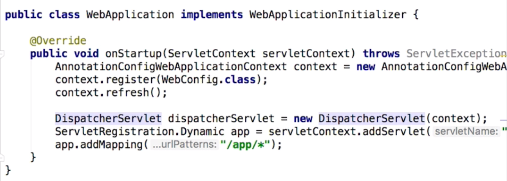

# Spring MVC


1. 프로젝트 만들기
   - File -> New -> Project -> Spring Initializr
   - project 이름 설정
   - Java version 선택
   - Maven/Gradle 설정
   - 의존성 추가(Web==Spring Boot Starter, Lombok, Thymleaf)


## 1부. Spring MVC 동작 원리

1. MVC란?

   - M: Model

     - 평범한 자바 객체 POJO
     - 도메인 객체
     - DTO로 화면에 전달할 객체
     - 화면에서 전달 받은 데이터를 담고 있는 객체

   - V: View

     - HTML, JSP, Thymleaf 등
     - 데이터를 보여주는 역할
     - HTML, JSON, XML 등 다양한 형태로 보여줄 수 있다.

   - C: Controller

     - Spring @MVC

     - 사용자 입력을 받아 모델 객체의 데이터를 변경

     - 사용자 입력을 받아 모델 객체를 뷰에 전달하는 역할

       - 입력값 검증

       - 입력 받은 데이터로 모델 객체 변경

       - 변경된 모델 객체를 뷰에 전달

2. MVC 장점

   - 동시 다발적(Simultaneous) 개발: 백엔드 개발자와 프론테엔드 개발자가 독립적으로 개발을 진행할 수 있다.
   - 높은 결합도: 논리적으로 관련있는 기능을 하나의 컨트롤러로 묶거나, 특정 모델과 관련있는 뷰를 그룹화 할 수 있다.
   - 낮은 의존성: 뷰, 모델, 컨트롤러는 각각 독립적이다.
   - 개발 용이성: 책임이 구분되어 있어 코드 수정하는 것이 편한다.
   - 한 모델에 대한 여려 형태의 뷰를 가질 수 있다.

3. MVC 단점
   - 코드 네비게이션 복잡함
   - 코드 일관성 유지에 노력이 필요함
   - 높은 학습 곡선

4. 서블릿(Servlet)
   - 자바 엔터프라이즈 에디션은 웹 애플리케이션 개발용 스펙과 API 제공
   - 요청 당 Thread 사용( 새로 만들거나, Pool에서 가져옴)
   - 그 중에 가장 중요한 클래스중 하나가 HttpServlet.
   - CGI(Common Gatewat Interface): Servlet 이전에 사용하던 기술
5. 서블릿 장점
   - 빠르다.
   - 플랫폼에 독립적이다.
   - 보안이 제공된다.
   - 이식성이 있다.
6. 서블릿 엔진/컨테이너 종류
   - 톰캣
   - 제티
   - 언더토 
7. 서블릿 엔진/컨테이너 역할
   - 세션 관리
   - 네트워크 서비스
   - MIME 기반 메시지 인코딩 디코팅
   - 서블릿 생명주기 관리
8. 서블릿 생명주기
   - Servlet Container가 Servlet instance init() 메소드를 호출하여 초기화 한다.
     - 최초 요청을 받았을 때, 한번 초기화 하고 나면 그 다음 요청부터는 이 과정이 생략된다.
   - Servlet이 초기화 된 다음부터 클라이언트의 요청을 처리할 수 있다.
     - 각 요청은 별도의 쓰레드로 처리하고 이때, Servlet instance service() 메소드를 호출한다.
     - service() 메소드 안에서, http 요청/응답을 처리한다.
     - service() 메소드는 보통 HTTP Method에 따라 doGet(), doPost() 등으로 처리를 위임한다.
     - 즉, 보통 doGet(), doPost() 메소드에서 요청에 대한 처리를 로직을 구현한다.
   - Servlet Container의 판단에 따라, Servlet instance를 메모리에서 내려야 할 시점에 destroy()를 호출한다.
9. 서블릿 생명주기 요약
   - init
   - doGet
   - doPost
   - destroy

10. 서블릿 리스너와 필터

    - 서블릿 리스터: 웹 애플리케이션에서 발생하는 주요 이벤트를 감지하고, 각 이벤트에 특별한 작업이 필요한 경우에 사용할 수 있다.

      - Servlet Context level event(db 연결/해제시 사용 할 수 있다.)
        - Context LifeCycle event
        - Context Attribute Change event
      - Session level event
        - Session LifeCycle event
        - Session Attribute Change event

    - 서블릿 필터: 클라이언트 요청을 서블릿으로 보내기전에, 서블릿의 응답을 클라이언트로 보내기 전에, 특별한 처리가 필요한 경우에 사용할 수 있다.

      - 체인 형태 구조(A,B 순서대로 적용)

      - doFilter() 메소드를 통해 사용

        


### 7) Spring IoC Container 연동

**Servlet에서 Spring이 제공하는 IoC 컨테이너 활용하는 방법**

1. ContextLoaderListner
   - Servlet Listner 구현체
   - ApplicationContext를 만들어 준다.
   - ApplicationContext를 Servlet Context LifeCycle에 따라 등록하고 소멸시켜준다.
   - Servlet에서 IoC Container를 ServletContext를 통해 꺼내 사용할 수 있다.
2. 사용법
   - pom.xml에 spring-webmvc dependency 추가
   - web.xml 파일에 <listener>태그를 추가한다.
   - <listener>태그 내부에 <listener-class>org.springframework.web.context.ContextLoaderListener를 추가한다.
3. 동작 과정
   - Spring IoC Container(즉, ApplicationContext)를 Servlet Context에 등록해주게 됨.
   - 그러면, Servlet 생명주기에 맞춰서 spring ApplicationContext가 바인딩 되어 동작하게 됨.
   - Servlet이 종료되는 시점에 spring ApplicationContext를 제거해줌.


### 8) Spring MVC 연동

**Spring이 제공하는 Servlet 구현체 DispatcherServlet 사용하기**

1. DispatcherServlet

   - Spring MVC의 핵심
   - Front Controller 역할 수행
     - 모든 요청을 받아 적절하게 다른 Controller에게 dispatch(= delegate, =위임)

   - 등록 방법
     - web.xml 파일에 여러개의 servlet과 servlet-mapping을 등록하여 servlet application을 구축할 수 있다는 것을 기억하자.
     - web.xml 파일에 <servlet>태그를 이용해 Dispatcher Servlet 등록
     - <init-param>태그를 통해 contextClass와 contextConfigLoacation을 등록
     - WebConfig.java 파일에서 @ComponentScan 어노테인션을 사용해 Bean 등록
     - 우리는 Spring MVC를 구현하기 위해서, Spring이 제공하는 DispatcherServlet을 web.xml파일에 등록하고, 적절한 경로를 servlet-mapping을 통해 등록할 수 있다.

   

**주의**

- Spring Boot 프로젝트는 Spring이라는 Java Application 안에, Tomcat이 뜨고, 그 안에 Servlet Container에 DispatcherServlet이 코드로 들어가 있는 형태
  - 즉, Spring이 밖에 나와 있는 형태
- Spring MVC 프로젝트는 tomcat이 먼저 뜨고, 그 안에 Servelt Container에 DispatcherServlet을 등록하는 형태
  - 즉, Spring이 안에 들어가 있는 형태


### 9) DispatcherServlet 동작 원리 1부

1. DispatcherServlet 초기화
   - 아래의 특별한 타입의 Bean들을 찾거나, 기본 전략에 해당하는 Bean들을 등록한다.
   - HandlerMapping: 핸들러를 찾아주는 인터페이스(디자인 패턴: Strategy pattern 사용)
   - HanlderAdapter: 핸들러를 실행하는 인터페이스(디자인 패턴: Strategy pattern 사용)
   - HandlerExceptionResolver
   - ViewResolver
   - ...
2. DispatcherServlet 동작 순서
   - 요청을 분석한다.(Locale, Theme, MultiPart 등)
   - (핸들러 맵핑을 위임하여)요청을 처리할 핸들러를 찾는다.
   - (등록되어 있는 핸들러 어댑터 중에) 해당 핸들러를 실행할 수 있는 "핸들러 어댑터"를 찾는다.
   - 찾아낸 "핸들러 어댑터"를 사용해서 핸들러의 응답을 처리한다.
     - 핸들러의 리턴값을 보고 어떻게 처리할지 판단한다.
     - View 이름에 해당하는 View를 찾아서 Model 데이터를 렌더링한다.
     - @ResponseEntity가 있다면 Convert를 사용해서 응답 본문을 만든다.
   - (부가적으로) 예외가 발생했다면, 예외 처리 핸들러에 요청 처리를 위임한다.
   - 최종적으로 응답을 보낸다.
3. HandlerMapping
   - RequestMappingHandlerMapping
4. HandlerAdapter
   - RequestMappingHandlerAdapter

**추가**

- @RestController = @Controller + @ResponseBody
- @ResponseBody가 없으면 문자열을 ModelAndView로 인식한다. -> model -> view -> 응답
- @ResponseBody가 있으면 문자열을 ModelAndView로 인식하지 않는다! -> 문자열 응답


### 10) DispatcherServlet 동작 원리 2부: SimpleController

- Dispatcher Servlet에는 기본적으로 아래 2개의 핸들러 맵핑이 등록되어 있기 때문에, 우리가 어노테이션으로 요청을 맵핑할 수 있는 것

1. HanlderMapping
   - BeanNameUrlHandlerMapping
   - RequestMappingHandlerMapping
2. HandlerAdapter
   - SimpleControllerHandlerAdapter

```java
//이렇게 우리가 직접 구현할 수도 있다.
@org.springframework.stereotype.Controller("/simple")
public class SimpleController implements Controller{
  @Override
  public ModelAndView handleRequest(HttpServletRequest request, HttpServletResponse response) throw Exception{
    return new ModelAndView("/WEB-INF/simple.jsp")
  }
}
```


### 11) DispatcherServlet 동작 원리 3부: 커스텀 ViewResolver

1. ViewResolver
   - InternalResourceViewResolver
2. InternalResourceViewResolver
   - Prefix
   - Suffix

```java
@Configuration
@ComponentScan
public class WebConfig{
  @Bean
  public InternalResourceViewResolver viewResolver(){
    InternalResourceViewResolver viewResolver = new InternalResourceViewResolver();
    viewResolver.setPrefix("/WEB-INF");
    viewResolver.setSuffix(".jsp");
    return viewResolver;
  }
}
```

```java
@org.springframework.stereotype.Controller("/simple")
public class SimpleController implements Controller{
  @Override
  public ModelAndView handleRequest(HttpServletRequest request, HttpServletResponse response) throw Exception{
    return new ModelAndView("simple") // Prefix, Suffix 덕분에 이렇게 사용가능
  }
}
  
```


### 12) Spring MVC 기본 구성 요소


1. DispatcherServlet의 기본 전략
   - DispatcherServlet.properties
2. MultipartResolver
   - 파일 업로드 요청 처리에 필요한 인터페이스
   - HttpServletRequest를 MultipartHttpServletReuqest로 변환해주어 요청이 담고 있는 File을 꺼낼 수 있는 API 제공
   - Spring Boot는 MultipartResolver 구현체를 기본 Bean으로 등록해서 제공함.
3. LocalResolver
   - 클라이언트 위치(Locale) 정보를 파악하는 인터페이스
   - 기본 전략은 요청의 accept-language를 보고 판단.
4. ThemeResolver
   - 애플리케이션에 설정된 테마를 파악하고 변경할 수 있는 인터페이스
   - 예륻들어, dark mode 변환 같은 것
5. HandlerMapping(여래개 빈 사용)
   - 요청을 처리할 핸들러를 찾는 인터페이스
   - RequestMappingHanlderMappling: 우리가 어노테이션을 이용해 설정한 핸들러를 기준으로 찾아줌
   - BeanNameUrlHandlerMapping: Bean이름을 기반으로 핸들러를 찾아줌
6. HandlerAdapter(여러개 빈 사용)
   - HandlerMapping이 찾아낸 "핸들러"를 처리하는 인터페이스
   - Spring MVC 확장력의 핵심
7. HandlerExceptionResolver(여러개 빈 사용)
   - 요청 처리 중에 발생한 에러를 처리하는 인터페이스
   - @ExceptionHandler로 정의한 메서드를 찾아서 사용
8. RequestToViewNameTranslator
   - 핸들러에는 View 이름을 명시적으로 리턴하지 않은 경우, 요청을 기반으로 뷰 이름을 판단하는 인터페이스
9. ViewResolver
   - View 이름(String)에 해당하는 View를 찾아내는 인터페이스
10. FlashMapManager
    - FlashMap 인스턴스를 가져오고 저장하는 인터페이스
    - Post요청에서 form 중복 요청을 거를 수 있다.
    - FlashMap은 주로 리다이렉션을 사용할 때 요청 매개변수를 사용하지 않고, Url을 더럽히지 않고, 깔끔하게 데이터를 전달하고 정리할 때 사용한다.
    - redirect:/events


### 13. Spring MVC 동작 원리 정리

1. 결국엔 Spring MVC는 굉장히 복잡한 Servlet = DispatcherServlet 이라고 생각하면 된다.

2. DispatcherServlet 초기화

   - 특정 타입에 해당하는 빈을 찾는다.
   - 없으면 기본 전략을 사용한다.(DispatcherServlet.properties)

3. Spring Boot를 사용하지 않는 Spring MVC

   - Servlet Container(ex. tomcat)에 등록한 웹 어플리케이션(WAR)에 DispatcherServlet을 등록한다.

     - 방법1) web.xml에 서블릿 등록

     - 방법2) WebApplicationInitializer에 자바 코드로 서블릿 등록(Spring 3.1+, Servlet 3.0 +)

       

   - 세부 구성 요소는 Bean 설정하기 나름

4. Spring Boot를 사용하는 Spring MVC

   - 자바 어플리케이션에 내장 톰캣을 만들어 그 안에 DispatcherServlet을 등록한다.
     - Spring Boot이 자동으로 설정해줌
   - Spring Boot 주관에 따라 여러 인터페이스 구현체를 빈으로 등록한다.


